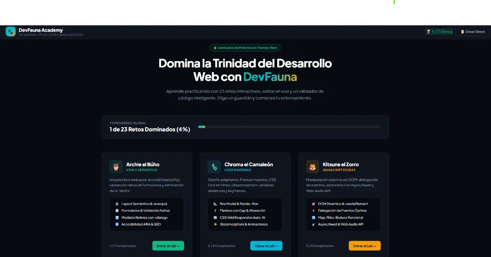

<div align="center">

# 🐾 DevFauna Academy — Suite Completa de Práctica

### Domina la Trinidad del Desarrollo Web: HTML5 Semántico, CSS3 Moderno & JavaScript ES2024

<a href="https://frankusqabant.github.io/proyecto-curso-html/" target="_blank" rel="noopener noreferrer">
  
</a>

[](https://frankusqabant.github.io/proyecto-curso-html/)
[](https://frankusqabant.github.io/proyecto-curso-html/)
[](https://frankusqabant.github.io/proyecto-curso-html/)
[](https://vitejs.dev/)

*¡Haz clic en la captura o en el badge para interactuar con la academia en vivo y superar los 23 retos!*

</div>

---

## 🦉 Currículum Exhaustivo de la Fauna Web (23 Retos)

### 🦉 1. HTML5 Semántico & Arquitectura (Archie el Búho — 7 Retos)
1. **Layout Semántico & Jerarquía Sagrada:** `<header>`, `<nav>`, `<main>`, `<article>`, `<footer>`.
2. **Textos Técnicos & Listas Especializadas:** `<dl>`, `<dt>`, `<dd>`, `<mark>`, `<time>`.
3. **Imágenes Responsivas de Élite:** `<picture>`, `<source media="...">`, `<figure>`, `<figcaption>`.
4. **Formularios con Validación Nativa:** `<input type="email">`, `<datalist>`, `required`.
5. **Tablas de Datos Accesibles:** `<table>`, `<thead>`, `<tbody>`, `<th scope="col">`, `<caption>`.
6. **Componentes Interactivos Nativos:** `<dialog>` con modal y backdrop, `<details>` y `<summary>`.
7. **Accesibilidad ARIA & SEO:** Atributos `aria-label`, `aria-live="polite"` y metadatos OpenGraph.

---

### 🦎 2. CSS3 Moderno & Layouts Adaptativos (Chroma el Camaleón — 8 Retos)
1. **El Secreto del Box Model:** `box-sizing: border-box`, `outline` y contención.
2. **Flexbox Maestro:** `justify-content`, `align-items`, `gap` y distribución dinámica.
3. **CSS Grid Responsivo en 1 Línea:** `repeat(auto-fit, minmax(180px, 1fr))` sin media queries.
4. **Posicionamiento Sticky:** `position: sticky`, `top: 0` y apilamiento `z-index`.
5. **Custom Properties & Theming:** Variables CSS `:root`, `var(--accent)`, `calc()` y temas.
6. **Glassmorphism Puro:** `backdrop-filter: blur(16px)` y superficies ahumadas.
7. **Transiciones & Curvas Bézier:** `transition`, `cubic-bezier()` y física elástica al hover.
8. **Animaciones Continuas con Keyframes:** `@keyframes pulseGlow` y bucles infinitos.

---

### 🦊 3. JavaScript Moderno ES2024 (Kitsune el Zorro — 8 Retos)
1. **Sintaxis Moderna & Ternarios:** `const/let`, Template Literals, operador ternario (`? :`).
2. **Arrow Functions & Desestructuración:** `=>`, extracción `{ nombre, ...resto }`, operador spread (`...`).
3. **Manipulación Dinámica del DOM:** `document.createElement()`, `classList.add()`, `append()`.
4. **Delegación de Eventos de Alto Rendimiento:** `addEventListener`, `e.target.closest()`, `dataset`.
5. **Arreglos Funcionales:** Métodos `.map()`, `.filter()` y `.reduce()` sin bucles clásicos.
6. **Asincronía Moderna:** `async/await`, promesas y control de fallos con `try/catch`.
7. **Persistencia con LocalStorage & Debounce:** Autoguardado optimizado en disco.
8. **Web Audio API & Síntesis Sonora:** `AudioContext`, osciladores senoidales y nodos de volumen.

---

## ⚡ Características de la Plataforma

- 🧪 **Test Runner en Vivo:** Botón interactivo que ejecuta pruebas automáticas sobre tu código y te avisa exactamente qué etiquetas o métodos faltan por implementar.
- 💡 **Sistema de Pistas Progresivas:** Ayuda guiada para cada reto sin arruinar la solución.
- ✨ **Cargador de Soluciones:** Compara tu código con la implementación oficial del mentor animal.
- 🏆 **Medidor de Maestría:** Guarda tu progreso en `localStorage` con indicadores de superación (`✅`).
- 🚀 **Ultraligero:** Todo el currículum de 23 retos + validador en **23 KB gzip** y carga instantánea.

---

## 🚀 Instalación y Uso Local

```bash
git clone https://github.com/FrankUsqAbant/proyecto-curso-html.git
cd proyecto-curso-html
npm install
npm run dev
```

Abre en tu navegador: `http://localhost:3002/`

---

<div align="center">

**Hecho con 💚 por [Frank Abanto](https://github.com/FrankUsqAbant)** • [Demo en Vivo](https://frankusqabant.github.io/proyecto-curso-html/)

</div>
